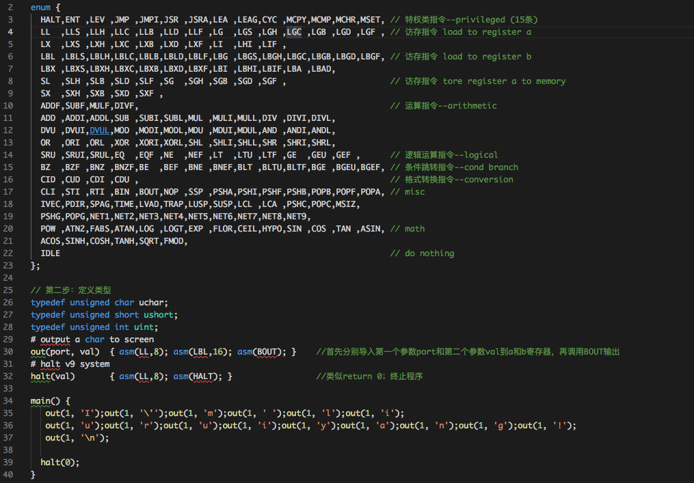
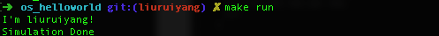

# lec1: 操作系统概述

---

## **提前准备**

（请在上课前完成）

* 完成lec1的视频学习和提交对应的在线练习
* git pull ucore\_os\_lab, ucore\_os\_docs, os\_tutorial\_lab, os\_course\_exercises in github repos。这样可以在本机上完成课堂练习。
* 知道OS课程的入口网址，会使用在线视频平台，在线练习/实验平台，在线提问平台\(piazza\)
  * [http://os.cs.tsinghua.edu.cn/oscourse/OS2019spring](http://os.cs.tsinghua.edu.cn/oscourse/OS2019spring)

* 会使用linux shell命令，如ls, rm, mkdir, cat, less, more, gcc等，也会使用linux系统的基本操作。
* 在piazza上就学习中不理解问题进行提问。

# 思考题

## 填空题

* 当前常见的操作系统主要用\_\_ARM, C, C++\_\_编程语言编写。
* "Operating system"这个单词起源于\_\_Operator\_\_ 。
* 在计算机系统中，控制和管理\_\_各种资源\_\_ 、有效地组织\_\_多道程序\_\_运行的系统软件称作\_\_操作系统\_\_ 。
* 允许多用户将若干个作业提交给计算机系统集中处理的操作系统称为\_\_批处理\_\_操作系统
* 你了解的当前世界上使用最多的操作系统是\_\_Android\_\_ 。
* 应用程序通过\_\_系统调用\_\_接口获得操作系统的服务。
* 现代操作系统的特征包括\_\_并发性\_\_ ， \_\_虚拟性\_\_ ， \_\_异步性\_\_ ，\_\_共享性和持久性\_\_ 。
* 操作系统内核的架构包括\_\_宏内核（单体内核）\_\_ ， \_\_微内核\_\_ ， \_\_外核\_\_ 。（简单结构、分层结构、微内核结构、外核结构和虚拟机结构 ？？ppt所示）

## 问答题

- 请总结你认为操作系统应该具有的特征有什么？并对其特征进行简要阐述。

　　　　答：我认为操作应该具有的特征应该有：并发性，虚拟性，异步性，共享性和持久性。  
　　　　　　并发性：计算机系统中同时存在多个运行的程序，需要OS管理和调度。并发是指两个或多个事件在同一时间间隔内发生，在多道程序环境下，一段时间内宏观上有多个程序在同时执行，而在同一时刻，单处理器环境下实际上只有一个程序在执行，故微观上这些程序还是在分时的交替进行。操作系统的并发是通过分时得以实现的。操作系统的并发性是指计算机系统中同时存在多个运行着的程序，因此它具有处理和调度多个程序同时执行的能力。  
　　　　　　虚拟性：虚拟是指把一个物理上的实体变为若干个逻辑上的对应物。在操作系统中利用了多种虚拟技术，分别用来实现虚拟处理器、虚拟内存和虚拟外部设备。多道程序设计技术，让每个用户都觉得有一个计算机专门为他服务。  
　　　　　　异步性：在多道程序环境下，允许多个程序并发执行，但由于资源有限，进程的执行不是一贯到底，而是走走停停，以不可预知的速度向前推进，这就是进程的异步性。异步性使得操作系统运行在一种随机的环境下，可能导致进程产生于时间有关的错误。但是只要运行环境相同，操作系统必须保证多次运行进程，都获得相同的结果。  
　　　　　　共享性：系统中的资源可供内存中多个并发执行的进程共同使用。但是事实上，只能做到互斥共享，或者说同时。  
　　　　　　持久性：通过实现文件系统，操作系统可以将程序以及数据存储在磁盘等存储介质中。操作系统中的文件系统支持把数据方便地从磁盘等存储介质上存入和取出。
　　　　　　

- 为什么现在的操作系统基本上用C语言来实现？为什么没有人用python，java来实现操作系统？

　　答：我认为写操作的编程语言应该有以下几点要求：  
　　　　1. 需要使用其的开发者众多，最好是一种大众语言；  
　　　　2. 需要支持跨平台编译，不能只是在某个特定平台下编译；  
　　　　3. 需要是编译型语言，或者有一个高效的解释器；  
　　　　4. 需要有方便的操作硬件的功能，并且比较容易嵌入汇编代码；  
　　　　5. 具有良好的性能，兼容性好，容易链接、扩展、改造或者调用第三方的运行库，方便移植；  
　　　　综上所述，C语言是编译型语言，并且具有良好的性能，能够直接嵌入汇编，并且可以方便地操作硬件，所以常用C语言实现操作系统。python和Java不容易嵌入汇编，并且性能无法保证，其软件效率不高，所以使用者甚少。

---

## 可选练习题

---

- 请分析并理解[v9\-computer](https://github.com/chyyuu/os_tutorial_lab/blob/master/v9_computer/docs/v9_computer.md)以及模拟v9\-computer的em.c。理解：在v9\-computer中如何实现时钟中断的；v9 computer的CPU指令，关键变量描述有误或不全的情况；在v9\-computer中的跳转相关操作是如何实现的；在v9\-computer中如何设计相应指令，可有效实现函数调用与返回；OS程序被加载到内存的哪个位置,其堆栈是如何设置的；在v9\-computer中如何完成一次内存地址的读写的；在v9\-computer中如何实现分页机制。

- 请编写一个小程序，在v9-cpu下，能够输出字符

　　　　答：学习github程序代码，实现输出 “I'm liuruiyang！” 程序。首先导入操作指令集，再定义输出函数out和程序终止返回函数halt，最后在main函数中调用输出“I'm liuruiyang！”  

	
	

- 输入的字符并输出你输入的字符

- 请编写一个小程序，在v9-cpu下，能够产生各种异常/中断

- 请编写一个小程序，在v9-cpu下，能够统计并显示内存大小

- 请分析并理解[RISC-V CPU](http://www.riscvbook.com/chinese/)以及会使用模拟RISC\-V(简称RV)的qemu工具。理解：RV的特权指令，CSR寄存器和在RV中如何实现时钟中断和IO操作；OS程序如何被加载运行的；在RV中如何实现分页机制。
  - 请编写一个小程序，在RV下，能够输出字符
  - 输入的字符并输出你输入的字符
  - 请编写一个小程序，在RV下，能够产生各种异常/中断
  - 请编写一个小程序，在RV下，能够统计并显示内存大小
