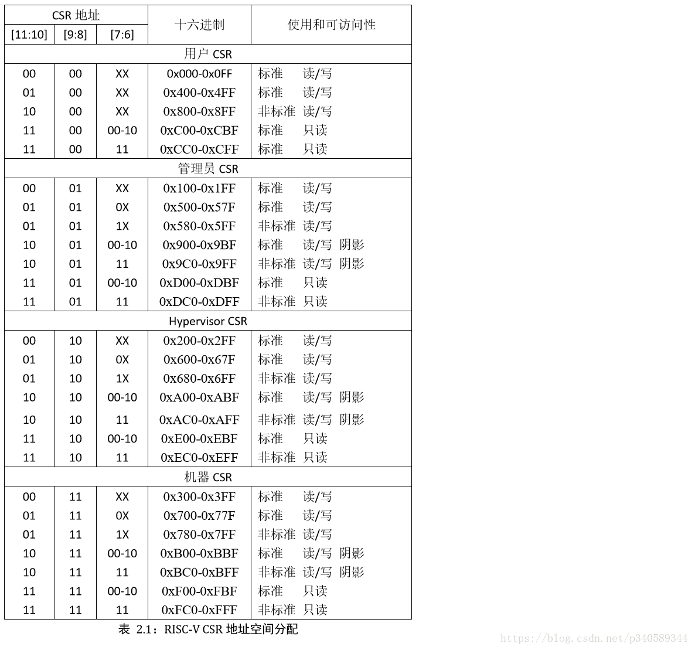

# lec2：lab0 SPOC思考题

## **提前准备**
（请在上课前完成，option）

- 完成lec2的视频学习
- git pull ucore_os_lab, os_tutorial_lab, os_course_exercises  in github repos。这样可以在本机上完成课堂练习。
- 了解代码段，数据段，执行文件，执行文件格式，堆，栈，控制流，函数调用,函数参数传递，用户态（用户模式），内核态（内核模式）等基本概念。思考一下这些基本概念在不同操作系统（如linux, ucore,etc.)与不同硬件（如 x86, riscv, v9-cpu,etc.)中是如何相互配合来体现的。
- 安装好ucore实验环境，能够编译运行ucore labs中的源码。
- 会使用linux中的shell命令:objdump，nm，file, strace，gdb等，了解这些命令的用途。
- 会编译，运行，使用v9-cpu的dis,xc, xem命令（包括启动参数），阅读v9-cpu中的v9\-computer.md文档，了解汇编指令的类型和含义等，了解v9-cpu的细节。
- 了解基于v9-cpu的执行文件的格式和内容，以及它是如何加载到v9-cpu的内存中的。
- 在piazza上就学习中不理解问题进行提问。

---

## 思考题

- 你理解的对于类似ucore这样需要进程/虚存/文件系统的操作系统，在硬件设计上至少需要有哪些直接的支持？至少应该提供哪些功能的特权指令？

	> 答：在硬件设计上至少需要提供的支持有 虚存管理、可读写的安全可靠的文件系统、时钟中断等  
	
	> 至少需要提供特权指令类型及功能如下：  
		　　1. Exceptions：LIDT, LTR, IRET, STI, CLI（中断/异常/系统服务等管理指令）  
		　　2. Virtual Memory: MOV CRn, INVLPG, INVPCID（TLB/MMU等管理指令）  
		　　3. Privilege Modes: SYSRET, SYSEXIT, IRET（调整特权级管理指令）  
		　　4. Segmentation/Paging: LGDT, LLDT CRx: CR0,CR3（分段分页管理指令）....

- 你理解的x86的实模式和保护模式有什么区别？你认为从实模式切换到保护模式需要注意那些方面？

	> 答：保护模式和实模式的根本区别是进程内存是否受保护。实模式将整个物理内存看成分段的区域，程序代码和数据位于不同区域，系统程序和用户程序没有区别对待，而且每一个指针都是指向“实在”的物理地址。这样一来，用户程序的一个指针如果指向了系统程序区域或其他用户程序区域，并改变了值，那么对于这个被修改的系统程序或用户程序，其后果就很可能是灾难性的。为了克服这种低劣的内存管理方式，处理器厂商开发出保护模式。这样，物理内存地址不能直接被程序访问，程序内部的地址（虚拟地址）要由操作系统转化为物理地址去访问，程序对此一无所知。
	
- 物理地址、线性地址、逻辑地址的含义分别是什么？它们之间有什么联系？

	> 答：实模式和保护模式的区别有：  
	　　1. x86的实模式是CPU启动的时候的模式，这时候就相当于一个速度超快的8086；而保护模式是操作系统接管CPU后CPU进入的模式。  
	　　2. 二者能够访问的物理内存空间大下不同。实模式下软件可访问的物理内存空间不能超过1M；而保护模式下可访问4G的物理内存空间(32条地址线)。  
	　　3. 实模式下指针访问的是实际的物理地址，这样系统进程内存不受保护；而保护模式下物理内存不能直接被程序访问，其指针指向的虚拟地址都将由操作系统转换为实际物理地址再执行访问，实现了对进程内存的保护。  
	　　4. 实模式下不能使用多线程，也不能实现权限分级；而保护模式下支持内存分页机制，提供对虚拟内存的良好支持，还支持优先级机制和良好的检查机制。  
		
	> * 物理地址：物理内存地址空间是处理器提交到总线上用于访问计算机系统中的内存和外设的最终地址，一个计算机系统只有一个物理地址空间。  
	> * 线性地址：线性地址空间是在操作系统的虚存管理之下每个运行的应用程序能访问的地址空间。每个运行的应用程序都认为自己独享整个西算计系统的地址空间，这样可以让多个运行的应用程序之间相互隔离。  
	> * 逻辑地址：逻辑地址空间是应用程序直接使用的地址空间。  

- 你理解的risc-v的特权模式有什么区别？不同模式在地址访问方面有何特征？

	> 答：RISC-V架构定义了四种工作模式，又称特权模式（Privileged Mode）：  
		　　1. Machine Mode：机器模式，简称M Mode。    
		　　2. Supervisor Mode：监督模式，简称S Mode。  
	 	　　3. User Mode：用户模式，简称U Mode。  
		　　4. Hypervisor：简称H Mode。  
		　　    
	> RISC-V架构定义M Mode为必选模式，另外两种为可选模式。通过不同的模式组合可以实现不同的系统。不同的特权级包含多个 CSR（control and status register，控制和状态寄存器）寄存器。标准 RISC-V ISA 设置了一个 12 位的编码空间（csr[11:0]）可用于 4096 个 CSR。根据约定，CSR 地址的高 4 位（csr[11:8]）用于编码CSR根据特权级读写的可访问性。最高 2 位（csr[11:10]）指示这个寄存器是否是可以读/写（00、01或者10），还是只读的（11）。后面 2 位（csr[9:8]）指示了能够访问这个 CSR 所需要的最低特权级（用户级是 00，管理员级是 01）
<div style="text-align:center;">
	
</div>

- 理解ucore中list_entry双向链表数据结构及其4个基本操作函数和ucore中一些基于它的代码实现（此题不用填写内容）

- 对于如下的代码段，请说明":"后面的数字是什么含义
```
 /* Gate descriptors for interrupts and traps */
 struct gatedesc {
    unsigned gd_off_15_0 : 16;        // low 16 bits of offset in segment
    unsigned gd_ss : 16;            // segment selector
    unsigned gd_args : 5;            // # args, 0 for interrupt/trap gates
    unsigned gd_rsv1 : 3;            // reserved(should be zero I guess)
    unsigned gd_type : 4;            // type(STS_{TG,IG32,TG32})
    unsigned gd_s : 1;                // must be 0 (system)
    unsigned gd_dpl : 2;            // descriptor(meaning new) privilege level
    unsigned gd_p : 1;                // Present
    unsigned gd_off_31_16 : 16;        // high bits of offset in segment
 };
```

	> 答：这些数字表示该成员变量的位宽，即其所占的二进制位数(bit)。如 **gd_off_15_0** 表示段中偏移量低16位，其后面的 **16** 表示其占位宽为16。他们一共构成了一个 8 字节大小的中断描述符。

- 对于如下的代码段，

```
#define SETGATE(gate, istrap, sel, off, dpl) {            \
    (gate).gd_off_15_0 = (uint32_t)(off) & 0xffff;        \
    (gate).gd_ss = (sel);                                \
    (gate).gd_args = 0;                                    \
    (gate).gd_rsv1 = 0;                                    \
    (gate).gd_type = (istrap) ? STS_TG32 : STS_IG32;    \
    (gate).gd_s = 0;                                    \
    (gate).gd_dpl = (dpl);                                \
    (gate).gd_p = 1;                                    \
    (gate).gd_off_31_16 = (uint32_t)(off) >> 16;        \
}
```
如果在其他代码段中有如下语句，
```
unsigned intr;
intr=8;
SETGATE(intr, 1,2,3,0);
```
请问执行上述指令后， intr的值是多少？

> 答：执行上述指令后，intr 的值为 0x20003。  
　　计算后该结构为（高地址） 00000000 00000000 10001111 00000000 00000000 00000010 00000000 00000011 （低地址）  
　　unsigned 占用 4 字节，即 32 位，getedesc 占用 8 字节，即 64 位。按题目操作，由于 X86 使用小端存储，intr 所占内存对应位置应该是 getedesc 的低 32 位。同样由于 X86 使用小端存储，所以 intr 高 16 位为 gd\_ss，低16位为 gd\_off\_15\_0。  
　　参考资料：http://blog.sina.com.cn/s/blog_8b08096f0102ux2y.html  
　　参考资料：https://www.cnblogs.com/Dumblidor/p/6959296.html　　

### 课堂实践练习

#### 练习一

1. 请在ucore中找一段你认为难度适当的AT&T格式X86汇编代码，尝试解释其含义。

	> 答：我选择的代码如下，代码来自于 trapentry.S：

		.text
		.globl __alltraps
		__alltraps:
		    # push registers to build a trap frame
		    # therefore make the stack look like a struct trapframe
		    pushl %ds
		    pushl %es
		    pushl %fs
		    pushl %gs
		    pushal
	
		    # load GD_KDATA into %ds and %es to set up data segments for kernel
		    movl $GD_KDATA, %eax
		    movw %ax, %ds
		    movw %ax, %es
		
		    # push %esp to pass a pointer to the trapframe as an argument to trap()
		    pushl %esp
		
		    # call trap(tf), where tf=%esp
		    call trap
		
		    # pop the pushed stack pointer
		    popl %esp
		
		    # return falls through to trapret...
		.globl __trapret
		__trapret:
		    # restore registers from stack
		    popal
		
		    # restore %ds, %es, %fs and %gs
		    popl %gs
		    popl %fs
		    popl %es
		    popl %ds
		
		    # get rid of the trap number and error code
		    addl $0x8, %esp
		    iret  


	> 本段代码要实现的目标是实现中断服务例程的进入以及结束后的返回。首先在执行中断服务例程之前通过 push 操作将寄存器的值压栈，然后将 GD_KDATA 加载到 DS 和 ES 寄存器以建立内核态的数据段。再将 esp 寄存器的值(trapfram 的指针)压栈作为 trap 函数的参数，然后调用 C 函数 trap 执行中断服务例程。当执行结束后将 esp 原来的值弹出，然后依次恢复之前压栈保存的寄存器的值，最后去掉陷阱编号和错误代码后调用 iret 指令返回。

2. (option)请在rcore中找一段你认为难度适当的RV汇编代码，尝试解释其含义。

#### 练习二

宏定义和引用在内核代码中很常用。请枚举ucore或rcore中宏定义的用途，并举例描述其含义。  

> 答：例如宏 **#define SETGATE(gate, istrap, sel, off, dpl)**，作为中断描述符的初始化的函数；宏  **#define STS_TG32 0xF**，作为一个常量使用，其作用于中断描述符的 gd\_type，代表是陷入门。


## 问答题

#### 在配置实验环境时，你遇到了那些问题，是如何解决的。

## 参考资料
 - [Intel格式和AT&T格式汇编区别](http://www.cnblogs.com/hdk1993/p/4820353.html)
 - [x86汇编指令集  ](http://hiyyp1234.blog.163.com/blog/static/67786373200981811422948/)
 - [PC Assembly Language, Paul A. Carter, November 2003.](https://pdos.csail.mit.edu/6.828/2016/readings/pcasm-book.pdf)
 - [*Intel 80386 Programmer's Reference Manual*, 1987](https://pdos.csail.mit.edu/6.828/2016/readings/i386/toc.htm)
 - [IA-32 Intel Architecture Software Developer's Manuals](http://www.intel.com/content/www/us/en/processors/architectures-software-developer-manuals.html)
 - [v9 cpu architecture](https://github.com/chyyuu/os_tutorial_lab/blob/master/v9_computer/docs/v9_computer.md)
 - [RISC-V cpu architecture](http://www.riscvbook.com/chinese/)
 - [OS相关经典论文](https://github.com/chyyuu/aos_course_info/blob/master/readinglist.md)
