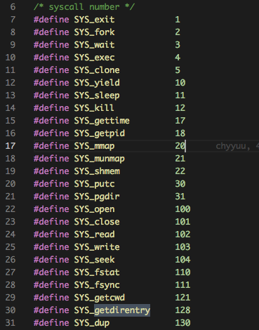
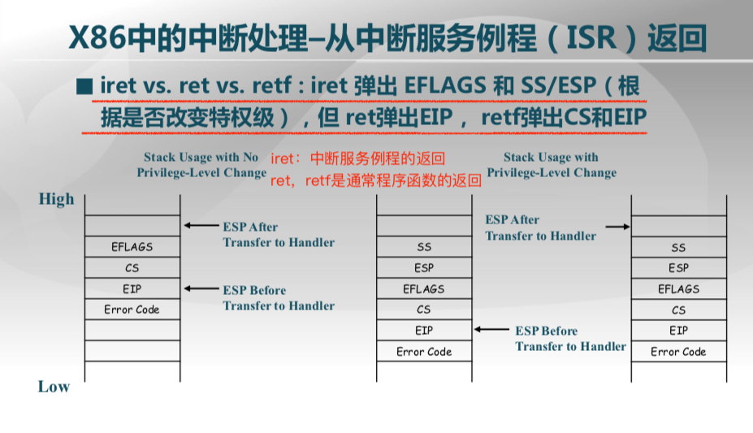

# lec 3 SPOC Discussion

## **提前准备**
（请在上课前完成）


 - 完成lec3的视频学习和提交对应的在线练习
 - git pull ucore_os_lab, v9_cpu, os_course_spoc_exercises  　in github repos。这样可以在本机上完成课堂练习。
 - 仔细观察自己使用的计算机的启动过程和linux/ucore操作系统运行后的情况。搜索“80386　开机　启动”
 - 了解控制流，异常控制流，函数调用,中断，异常(故障)，系统调用（陷阱）,切换，用户态（用户模式），内核态（内核模式）等基本概念。思考一下这些基本概念在linux, ucore, v9-cpu中的os*.c中是如何具体体现的。
 - 思考为什么操作系统需要处理中断，异常，系统调用。这些是必须要有的吗？有哪些好处？有哪些不好的地方？
 - 了解在PC机上有啥中断和异常。搜索“80386　中断　异常”
 - 安装好ucore实验环境，能够编译运行lab8的answer
 - 了解Linux和ucore有哪些系统调用。搜索“linux 系统调用", 搜索lab8中的syscall关键字相关内容。在linux下执行命令: ```man syscalls```
 - 会使用linux中的命令:objdump，nm，file, strace，man, 了解这些命令的用途。
 - 了解如何OS是如何实现中断，异常，或系统调用的。会使用v9-cpu的dis,xc, xem命令（包括启动参数），分析v9-cpu中的os0.c, os2.c，了解与异常，中断，系统调用相关的os设计实现。阅读v9-cpu中的cpu.md文档，了解汇编指令的类型和含义等，了解v9-cpu的细节。
 - 在piazza上就lec3学习中不理解问题进行提问。

## 第三讲 启动、中断、异常和系统调用-思考题

## 3.1 BIOS
-  请描述在“计算机组成原理课”上，同学们做的MIPS CPU是从按复位键开始到可以接收按键输入之间的启动过程。

	> 答：我们可以事先将监控程序通过软件直接烧到RAM中或者通过 flash 进行自启动，事实上这也就完成了 bootloader 的工作。点击复位键之后 CPU 从 0 地址开始执行程序，进行串口和 SRAM 的检查，并且在经过一系列的初始化操作之后通过串口发出 ready 的信号，我们便可以通过按键进行输入。

-  x86中BIOS从磁盘读入的第一个扇区是是什么内容？为什么没有直接读入操作系统内核映像？

	> 答：BIOS在完成硬件的初始化和自检之后，会根据CMOS中设置的启动顺序启动相应的设备。当按顺序启动时系统要启动硬盘，但是此时硬盘的文件系统并没有建立，BIOS无法识别硬盘的文件系统，所以无法直接启动操作系统。另外一个硬盘可以有多个分区，每个分区都有可能包括一个不同的操作系统，BIOS也无从判断应该从哪个分区启动，所以对待硬盘，所有的BIOS都是读取硬盘的0磁头、0柱面、1扇区的内容，然后把控制权交给这里面的MBR(Main Boot Record）。  
　　MBR由两个部分组成：即主引导记录MBR和硬盘分区表DPT。在总共512字节的主引导分区里其中MBR占446个字节（偏移0--偏移1BDH)，一般是一段引导程序，其主要是用来在系统硬件自检完后引导具有激活标志的分区上的操作系统。DPT占64个字节（偏移1BEH--偏移1FDH),一般可放4个16字节的分区信息表。最后两个字节“55，AA”（偏移1FEH，偏移1FFH)是分区的结束标志。
	
	> 答：磁盘上有文件系统，而文件系统多种多样，在机器出厂时不能限制只使用某种文件系统。BIOS不可能拥有对应所有文件系统的代码，为了增加灵活性，所以设置一个基本约定：不需要认识文件系统的格式也能读区加载程序，由加载程序识别磁盘的文件系统，然后读取磁盘中的操作系统内核映像到内存中来。

- 比较UEFI和BIOS的区别。

	> 答：UEFI全称“统一的可扩展固件接口”(Unified Extensible Firmware Interface)，是一种详细描述类型接口的标准。这种接口用于操作系统自动从预启动的操作环境，加载到一种操作系统上。大家都知道电脑中有一个BIOS设置，它主要负责开机时检测硬件功能和引导操作系统启动的功能。而uefi则是用于操作系统自动从预启动的操作环境，加载到一种操作系统上从而节省开机时间。UEFI启动是一种新的主板引导项，它被看做是BIOS的继任者。UEFI最主要的特点是图形界面，更利于用户对象图形化的操作选择。快速启动是可以提高开机后操作系统的启动速度。
	
	> uefi启动对比Bios启动的优势：  
	> 　　1、安全性更强。UEFI启动需要一个独立的分区，它将系统启动文件和操作系统本身隔离，可以更好的保护系统的启动。即使系统启动出错需要重新配置，我们只要简单对启动分区重新进行配置即可。而且，对于win8系统，它利用UEFI安全启动以及固件中存储的证书与平台固件之间创建一个信任源，可以确保在加载操作系统之前，近能够执行已签名并获得认证的“已知安全”代码和启动加载程序，可以防止用户在根路径中执行恶意代码。UEFI启动和GRUB启动类似，在启动的时候可以调用EFIShell，在此可以加载指定硬件驱动，选择启动文件。比如默认启动失败，在EFIShell加载U盘上的启动文件继续启动系统。  
	　　2、启动配置更灵活，在启动调用上更加灵活，指定的启动选项失败也可以继续加载其他的。  
	　　3、支持容量更大，传统的BIOS启动由于MBR的限制，默认是无法引导超过2.1TB以上的硬盘的。随着硬盘价格的不断走低，2.1TB以上的硬盘会逐渐普及，因此UEFI启动也是今后主流的启动方式。


- 理解rcore中的Berkeley BootLoader (BBL)的功能。
	> 答：BBL is a supervisor execution environment for tethered RISC-V systems. It is designed to host the RISC-V Linux port.  
	https://www.bsdcan.org/2016/schedule/attachments/385_riscv_bsdcan16.pdf  
	> 完成的功能如下：  
	　　1. 硬件初始化（如DRAM，串口等）  
	　　2. 将引导参数传递给内核  
	　　3. 加载内核

## 3.2 系统启动流程

- x86中分区引导扇区的结束标志是什么？

	> 答：x86中分区引导扇区的结束标志是两字节的结束标志符 **0x55AA**。

- x86中在UEFI中的可信启动有什么作用？

	> 答：通过启动前的数字签名检查来保证启动介质的安全性

- RV中BBL的启动过程大致包括哪些内容？

	> 答：启动过程大致如下：  
	　　1. 硬件初始化（如DRAM，串口等）  
	　　2. 将引导参数传递给内核  
	　　3. 加载内核

## 3.3 中断、异常和系统调用比较
- 什么是中断、异常和系统调用？

	> 答：中断：来自硬件设备的处理请求（外部意外的响应）  
	　　异常：非法指令或者其他原因导致当前指令执行失败(如：内存出错)后的处理请求（指令执行意外的响应）  
	　　系统调用：应用程序主动向操作系统发出的服务请求（系统调用指令的响应）

-  中断、异常和系统调用的处理流程有什么异同？

	> 答：  
	>　　1. 源头上：  
	>　　　　　中断来源于外设。  
	>　　　　　异常来源于应用程序意想不到的行为。  
	>　　　　　系统调用来源于应用程序请求操作提供服务。  
	>　　2.响应方式上：  
	>　　　　　中断是异步。  
	>　　　　　异常是同步。  
	>　　　　　系统调用既有同步又有异步。   
	>　　3.处理机制上：  
	>　　　　　中断是持续的，对用户应用程序而言是透明的。  
	>　　　　　异常是杀死或重新执行意想不到的应用程序指令。  
	>　　　　　系统调用是等待和持续。 

- 以ucore/rcore lab8的answer为例，ucore的系统调用有哪些？大致的功能分类有哪些？

	> 在ucore lab8的answer中一共有25个系统调用，大致分为如下几类：  
	> 　　1. 进程管理：包括 fork / exit / wait / exec / yield / kill / getpid / sleep... 命令  
	> 　　2. 文件操作：包括 open / close / read / write / seek / fstat / fsync / getcwd / getdirentry / dup... 命令  
	> 　　3. 内存管理：pgdir... 命令  
	> 　　4. 外设输出：putc... 命令  
<div style="text-align:center;"> 
	<br>
</div>

## 3.4 linux系统调用分析
- 通过分析[lab1_ex0](https://github.com/chyyuu/ucore_lab/blob/master/related_info/lab1/lab1-ex0.md)了解Linux应用的系统调用编写和含义。(仅实践，不用回答)
- 通过调试[lab1_ex1](https://github.com/chyyuu/ucore_lab/blob/master/related_info/lab1/lab1-ex1.md)了解Linux应用的系统调用执行过程。(仅实践，不用回答)


## 3.5 ucore/rcore系统调用分析 （扩展练习，可选）
-  基于实验八的代码分析ucore的系统调用实现，说明指定系统调用的参数和返回值的传递方式和存放位置信息，以及内核中的系统调用功能实现函数。
- 以ucore/rcore lab8的answer为例，分析ucore 应用的系统调用编写和含义。
- 以ucore/rcore lab8的answer为例，尝试修改并运行ucore OS kernel代码，使其具有类似Linux应用工具`strace`的功能，即能够显示出应用程序发出的系统调用，从而可以分析ucore应用的系统调用执行过程。

 
## 3.6 请分析函数调用和系统调用的区别
- 系统调用与函数调用的区别是什么？

	> 答：函数调⽤/功能调⽤而言，会有一个压栈出栈处理，所有压栈出栈处理都是编译器完成。  
	　　系统调⽤要完成用户态和内核态的切换，并且做严格的检查，因为有状态切换等，所有代价⼤得多。  
	>
	　　系统调用 ：  
	　　　　1.使用INT和IRET指令，内核和应用程序使用的是不同的堆栈，因此存在堆栈的切换，从用户态切换到内核态，从而可以使用特权指令操控设备   
	　　　　2.依赖于内核，不保证移植性   
	　　　　3.在用户空间和内核上下文环境间切换，开销较大   
	　　　　4. 是操作系统的一个入口点   
	　　函数调用 ：  
	　　　　1.使用CALL和RET指令，调用时没有堆栈切换   
	　　　　2.平台移植性好   
	　　　　3.属于过程调用，调用开销较小   
	　　　　4.一个普通功能函数的调用


- 通过分析x86中函数调用规范以及`int`、`iret`、`call`和`ret`的指令准确功能和调用代码，比较x86中函数调用与系统调用的堆栈操作有什么不同？

	> 答：iret:中断服务例例程的返回；ret，retf是通常程序函数的返回   
	　　iret根据是否有特权级的改变，弹出EFLAGS 和 SS/ESP  
	　　ret弹出EIP  
	　　retf弹出CS和EIP  
	　　所以函数调用与系统调用的堆栈操作的不同在于系统调用有 SS：SP 的压栈出栈操作。
<div style="text-align:center;"> 
	<br>
</div>

- 通过分析RV中函数调用规范以及`ecall`、`eret`、`jal`和`jalr`的指令准确功能和调用代码，比较x86中函数调用与系统调用的堆栈操作有什么不同？

	> 答：jal 和 jalr 都是函数调用的功能，jal 会将地址保存在 $sa 寄存器中以便执行完成后返回，jalr 则可以自己选择保存的寄存器，整个调用过程不涉及返回地址的堆栈操作。  

	> 　　ecall 原本是 scall，是超级用户模式下的系统调用，通过引发环境调用异常来请求执行环境。
	
	> 　　尚不清楚 eret 指令操作
	>　　(参考曾军同学的回答)


## 课堂实践 （在课堂上根据老师安排完成，课后不用做）
### 练习一
通过静态代码分析，举例描述ucore/rcore键盘输入中断的响应过程。

### 练习二
通过静态代码分析，举例描述ucore/rcore系统调用过程，及调用参数和返回值的传递方法。
